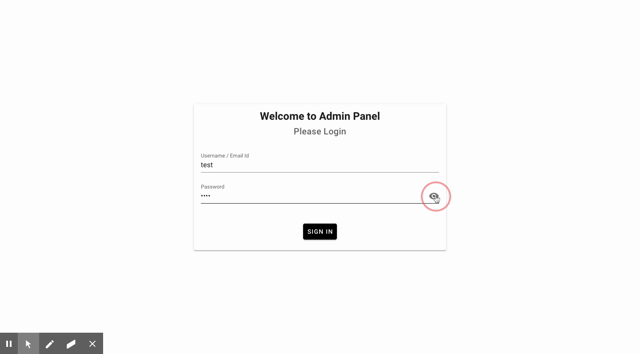

# vue-admin-panel
vue 2 admin panel with template with vuetify, vuex, vue-router, vue-router-middleware-plugin, lodash and axios.

### Live demo: https://rakeshsipai.github.io/vue-beginner-admin-panel-demo/

## Project setup
```
npm install
```

### Compiles and hot-reloads for development
```
npm run serve
```

### Compiles and minifies for production
```
npm run build
```

### Run your tests
```
npm run test
```

### Lints and fixes files
```
npm run lint
```
## Demo



